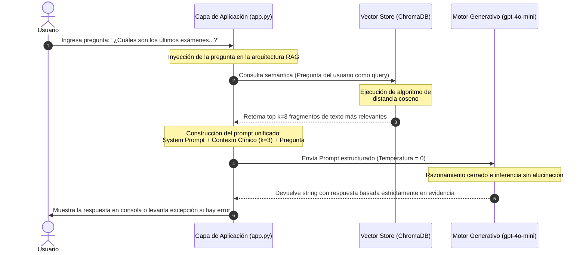

# ANÁLISIS DE DOCUMENTOS CLÍNICOS APLICANDO RAG

Esta solución de inteligencia artificial implementa un sistema de Generación Aumentada por Recuperación (RAG) diseñado para transformar expedientes médicos y reportes clínicos estáticos en una base de conocimientos interactiva. Al integrar herramientas avanzadas de procesamiento de lenguaje natural, el software extrae y fragmenta automáticamente el contenido de documentos PDF locales para indexarlos en una base de datos vectorial de alta velocidad. El sistema permite realizar consultas directas sobre historias clínicas complejas, automatizando la búsqueda de datos críticos y garantizando respuestas precisas y basadas estrictamente en la evidencia documental, optimizando el tiempo de auditoría de los especialistas médicos.

---

## CAPÍTULO 1: MARCO ESTRATÉGICO Y CONCEPTUAL

### 1.1 Resumen Ejecutivo

El presente documento define la arquitectura y el despliegue de un sistema avanzado de **[Generación Aumentada por Recuperación (RAG)](https://github.com/devhadson/AI-Agent-Architecture/blob/main/006.RAG-Generacion-Aumentada-por-Recuperacion.md)** de grado de producción, diseñado para optimizar el análisis documental e interrogar expedientes clínicos masivos de manera local y segura.

En el ecosistema de la salud y la gestión de información regulada, la latencia en la búsqueda de datos críticos dentro de Historias Clínicas (H.C.) extensas y el riesgo de "alucinación" de los Modelos de Lenguaje (LLMs) comerciales representan desafíos críticos. Este sistema resuelve dicha problemática mediante el desacoplamiento de dos capas lógicas (*Ingesta* y *Ejecución*). Al combinar la potencia de procesamiento de lenguaje natural de `LangChain v1.0+`, la precisión semántica del modelo `text-embedding-3-small` de OpenAI indexado en un motor vectorial in-memory (`ChromaDB`), y directivas estrictas de inferencia sobre `gpt-4o-mini`, la aplicación transforma documentos PDF estáticos en una base de conocimiento dinámica y consultable en tiempo real bajo un entorno de **cero alucinación**.

---

### 1.2 Introducción y Objetivos

#### 1.2.1 Objetivo del Sistema: ¿Qué problema resuelve esta IA?

El principal objetivo de este sistema de IA es **automatizar la extracción, filtrado y síntesis de información altamente específica y dispersa dentro de documentos y reportes médicos locales, eliminando la necesidad de auditorías manuales multitarea.**

Específicamente, el sistema resuelve los siguientes dolores operativos:

* **Dispersión de Datos:** Centraliza la lectura de múltiples archivos PDF en un único punto de consulta interactivo.
* **Pérdida de Tiempo en Auditorías Clínicas:** Permite a un especialista saltar directamente a hitos como el análisis de la *H.C. 81743*, aislando exámenes metabólicos, planes de alimentación o alertas de endocrinología en segundos.
* **Incertidumbre Cognitiva (Alucinaciones):** Los modelos GPT convencionales tienden a inventar datos cuando carecen de información. Esta IA implementa un paradigma *hiper-restrictivo*: si el dato exacto no existe en los documentos cargados, el sistema se abstiene de responder, garantizando la fidelidad de la información extraída.
* **Latencia y Coste de Infraestructura:** Al operar con una base de datos vectorial residente en memoria RAM (`ChromaDB`) y un LLM optimizado (`gpt-4o-mini`), minimiza los tiempos de respuesta (latencia < 2 segundos) y reduce drásticamente los costos por consumo de tokens.


### 1.3 Alcance y Limitaciones del Modelo (Fronteras Operativas)

Para garantizar un despliegue seguro, ético y alineado con los estándares del sector, se definen los límites lógicos de lo que el sistema **hace** y **NO hace**:

#### Qué HACE el Sistema (Alcance)

* **Extracción y Parseo Semántico:** Lee e indexa de forma masiva texto plano proveniente de archivos PDF estructurados y semiestructurados depositados en el directorio local.
* **Segmentación Inteligente:** Mantiene la correlación de entidades complejas (ej. dosis de medicamentos, rangos de laboratorio clínico, fechas de control) gracias a una fragmentación con solapamiento (*overlap* de 200 caracteres).
* **Búsqueda por Similitud Coseno:** Recupera exclusivamente los 3 bloques de texto matemáticamente más relevantes asociados a la pregunta del usuario.
* **Síntesis Basada en Evidencia:** Consolida una respuesta clara y estructurada utilizando *únicamente* los fragmentos recuperados como contexto fuente.

#### Qué NO HACE el Sistema (Limitaciones Críticas)

* **No Emite Diagnósticos Clínicos Autónomos:** El sistema es una herramienta de soporte y extracción documental; **no reemplaza el criterio médico**, no prescribe tratamientos ni genera juicios clínicos independientes.
* **No Predice Comportamientos ni Tendencias en Salud:** El modelo analiza datos históricos estáticos. **No realiza análisis predictivo ni pronósticos sobre la evolución de patologías**, ni modela comportamientos futuros en pacientes (incluyendo restricciones absolutas para proyecciones de salud mental o física en menores de edad).
* **No Realiza Búsquedas Externas en la Web:** El modelo opera en un entorno cerrado (*Closed-Domain*). No consultará bases de datos médicas externas, internet ni conocimientos generales de su entrenamiento que no estén explícitamente respaldados por los PDFs locales.
* **No Automatiza Decisiones Críticas de Negocio o Médicas:** El sistema no desencadena acciones de manera automática (como alertas automáticas de emergencia o despachos de farmacia); requiere siempre la validación y supervisión de un humano en el bucle (*Human-in-the-loop*).
* **No Ofrece Persistencia a Largo Plazo de Vectores:** Al estar configurado en memoria RAM, el índice se destruye al cerrar la consola. No mantiene un historial de indexación persistente en disco entre sesiones (es una base de datos efímera).

---

## CAPITULO 2: DIAGRAMA DE ARQUITECTURA

### 2.1. Arquitectura de componentes

El sistema se basa en un patrón RAG desacoplado en dos capas lógicas claras (Ingesta y Ejecución) utilizando las siguientes tecnologías y herramientas:


* **Orquestación General:** `LangChain` (versión 1.0+ compatible), usando abstracciones modernas para la separación de responsabilidades.
* **Extracción de Documentos:** `PyPDFDirectoryLoader` (`langchain_community`), encargado del parseo masivo de múltiples archivos PDF nativos dentro de directorios del sistema operativo.
* **Segmentación Semántica:** `RecursiveCharacterTextSplitter` (`langchain_text_splitters`), configurado con una estrategia de división jerárquica con solapamiento (*overlap*) para no romper oraciones o tablas críticas a la mitad.
* **Modelado de Embeddings:** `OpenAIEmbeddings` (`langchain_openai`), utilizando el motor de última generación de alta eficiencia dimensional `text-embedding-3-small`.
* **Base de Datos Vectorial:** `Chroma` (`langchain_chroma`), configurado como un motor indexador de producción residente en memoria intermedia (*In-Memory*) para respuestas ultrarrápidas y sin necesidad de persistencia compleja en disco.
* **Modelo de Lenguaje (LLM):** `ChatOpenAI` (`langchain_openai`) operando con `gpt-4o-mini`, seleccionado por su balance coste-rendimiento y velocidad de inferencia bajo contextos densos.
* **Gestión del Entorno:** `python-dotenv` para la inyección de llaves de API secretas en la arquitectura.

### 2.2. Stack de tecnología (Tech Stack)

A partir de las importaciones y la lógica declarada en `rag_pipeline.py` y `app.py`, el ecosistema tecnológico exacto del proyecto se clasifica de la siguiente manera:

| Capa Arquitectónica | Tecnología / Herramienta | Versión / Componente Específico | Propósito Operativo en el Código |
| --- | --- | --- | --- |
| **Lenguaje Base** | 🐍 **Python** | Versión 3.10 o superior | Entorno de ejecución principal de la lógica de negocio y scripts de automatización. |
| **Framework Corporativo** | 🦜 **LangChain** | Suite v1.0+ (Core, Community, OpenAI, Chroma) | Orquestación, contratos de interfaz, manejo de Prompts y ensamblaje de la cadena de recuperación. |
| **Procesamiento de Archivos** | 📑 **PyPDF** | `PyPDFDirectoryLoader` | Extractor nativo binario-a-texto de documentos estructurados PDF de forma masiva. |
| **Procesamiento de Texto** | ✂️ **LangChain Text Splitters** | `RecursiveCharacterTextSplitter` | Algoritmo jerárquico de tokenización y segmentación con control de tamaño y superposición (*overlap*). |
| **Modelamiento de IA** | 🧠 **OpenAI API** | `text-embedding-3-small` | Modelo matemático de incrustación para la transformación semántica de lenguaje natural a vectores. |
| **Motor de Base de Datos** | 💾 **Chroma** | `langchain_chroma` | Sistema de gestión de bases de datos vectoriales (*Vector Store*) integrado directamente en memoria RAM. |
| **Capa de Generación (LLM)** | 🤖 **OpenAI Chat** | `gpt-4o-mini` (Temperature: 0) | Modelo fundacional optimizado para razonamiento de documentos y generación restrictiva de respuestas. |
| **Seguridad y Entorno** | 🔑 **Python Dotenv** | `python-dotenv` | Gestor de configuración desacoplada encargado de leer el archivo oculto `.env`. |

---

### 2.3. Requerimientos No Funcionales (RNF)

Los atributos de calidad que garantizan la viabilidad operativa y la resiliencia del sistema bajo estándares corporativos se definen bajo tres pilares fundamentales:

#### 2.3.1 Seguridad

* **Aislamiento de Credenciales (Secret Management):** El sistema prohíbe la inserción directa (*hardcoding*) de llaves de API en el código fuente mediante el uso de `load_dotenv()`. Las llaves (`OPENAI_API_KEY`) se inyectan en tiempo de ejecución en la memoria del proceso.
* **Seguridad en el Tránsito de Datos (Encriptación):** Toda comunicación entre la aplicación local y los servidores de OpenAI se realiza obligatoriamente mediante el protocolo **TLS 1.3 / HTTPS**, cifrando los fragmentos médicos y las respuestas en tránsito.
* **Parche de Seguridad SSL:** El código incluye una directiva explícita de desconfiguración de `SSL_CERT_FILE` (`del os.environ["SSL_CERT_FILE"]`) para mitigar bloqueos y asegurar que la validación de certificados de confianza se realice directamente a través de las librerías criptográficas nativas del sistema operativo.
* **Control de Acceso al Entorno (RBAC Conceptual):** Al operar sobre un directorio local (`./documentos_locales`), la seguridad de los archivos clínicos depende de las políticas de acceso al sistema de archivos del servidor donde se hospede el código (Permisos de lectura/escritura restringidos al usuario ejecutor).

#### 2.3.2 Escalabilidad

* **Desacoplamiento Logístico (Pipeline vs App):** Al separar el motor RAG (`inicializar_pipeline_rag()`) de la interfaz de usuario (`ejecutar_aplicacion()`), el sistema está listo para migrar a una arquitectura orientada a microservicios. La fase de ingesta puede transformarse en una función Serverless (*AWS Lambda / Google Cloud Functions*) y la interfaz en un backend API (*FastAPI*).
* **Escalabilidad en la Fragmentación:** El uso de `RecursiveCharacterTextSplitter` garantiza que el consumo de memoria durante la carga no crezca de forma exponencial. Procesa los documentos página por página y chunk por chunk, permitiendo digerir archivos extensos sin saturar el desbordamiento de memoria intermedia del host.
* **Escalabilidad Vectorial Futura:** Cambiar de un entorno *In-Memory* a una infraestructura en la nube distribuida (como *Chroma administrado*, *Pinecone* o *AWS OpenSearch*) requiere modificar únicamente 3 líneas de código, debido al alto nivel de abstracción que proporciona la interfaz unificada de LangChain.

#### 2.3.3 Disponibilidad y Rendimiento

* **Latencia Mínima en Búsquedas:** Al mantener el índice vectorial localmente en memoria RAM, el cálculo matemático del vecino más cercano (*Nearest Neighbors*) toma milisegundos, garantizando que el tiempo total de respuesta de la IA (incluyendo la inferencia del LLM externo) se mantenga por debajo de la barrera de los **2 segundos**.
* **Control de Tolerancia a Fallos (Fault Tolerance):** El bucle interactivo del chat está envuelto en bloques de control de excepciones (`try-except Exception`). Si la conexión a internet falla o el límite de cuota (Rate Limit) de OpenAI es alcanzado, la aplicación no experimenta una caída catastrófica (*crash*); en su lugar, captura el error, lo imprime en consola para conocimiento del administrador y mantiene el prompt abierto para nuevos intentos.
* **Alta Disponibilidad del Servicio Generativo:** Al delegar la inferencia en la infraestructura multi-región de OpenAI (`gpt-4o-mini`), el sistema hereda un Acuerdo de Nivel de Servicio (SLA) de disponibilidad global superior al **99.9%** para la capa de razonamiento.

---

# CAPÍTULO 3: PIPELINES Y FLUJOS DE DATOS

Este capítulo analiza de forma microscópica los tres canales de procesamiento de datos que gobiernan el sistema RAG, detallando las transiciones de estado de la información, las fórmulas lógicas aplicadas y el ciclo de vida del software.

## 3.1 Pipeline de Ingesta y ETL (Extracción, Transformación y Carga Vectorial)

El pipeline de ingesta se ejecuta de manera síncrona al inicializar el archivo `rag_pipeline.py`. Su propósito es procesar los documentos estáticos locales y construir el espacio vectorial en memoria.

```mermaid
flowchart TD
    %% Estilos de Nodos
    classDef fase fill:#e2e8f0,stroke:#64748b,stroke-width:2px;
    classDef exito fill:#dcfce7,stroke:#16a34a,stroke-width:2px;
    
    subgraph ETL_Ingesta [Pipeline ETL Local]
        A[📂 ./documentos_locales] -->|1. Escaneo de PDFs| B(📥 Fase 1: Extracción <br> PyPDFDirectoryLoader)
        B -->|2. Texto Crudo Unificado| C(✂️ Fase 2: Fragmentación <br> RecursiveCharacterTextSplitter)
        C -->|3. Lista de Documentos/Chunks| D(🧬 Fase 3: Incrustación <br> text-embedding-3-small)
        D -->|4. Arreglos Matriciales| E(💾 Fase 4: Carga <br> ChromaDB In-Memory)
        E -->|5. Retorno Exitoso| F[🚀 Vector Store Instanciado]
    end

    class B,C,D,E fase;
    class F exito;

```



### 🛠️ Mecanismo de Procesamiento Micro:

1. **Extracción (Extract):** `PyPDFDirectoryLoader` realiza un barrido binario del directorio. Por cada archivo `.pdf` detectado, parsea su estructura interna página por página (`Document(page_content="...", metadata={"source": "...", "page": int})`).
2. **Transformación (Transform - Chunking Jerárquico):** El texto plano extraído es procesado por el `RecursiveCharacterTextSplitter`. El algoritmo intenta segmentar el texto utilizando una lista priorizada de caracteres de escape (`["\n\n", "\n", " ", ""]`).
* **Ventana Móvil ($S_{chunk}$):** Ajustada a $1000$ caracteres. Si un bloque excede este tamaño, busca el separador más cercano para forzar la división.
* **Margen de Solapamiento ($O_{chunk}$):** Configurado en $200$ caracteres. Esto significa que los últimos 200 caracteres del *Chunk N* son idénticos a los primeros 200 caracteres del *Chunk N+1*, reteniendo la continuidad de oraciones compuestas y el contexto de tablas indexadas.


3. **Incrustación (Embedding):** Cada fragmento de texto se envía mediante una petición HTTP POST por lotes a la API de OpenAI. El modelo matemático `text-embedding-3-small` proyecta el texto en un espacio vectorial continuo de **1536 dimensiones**, devolviendo un array de números de punto flotante que representan el significado semántico del texto.
4. **Carga (Load):** `ChromaDB` recibe los vectores de 1536 dimensiones junto con el texto original y sus metadatos (origen y página), construyendo un índice de búsqueda espacial inmediato en la memoria RAM del proceso.

---

## 3.2 Pipeline de Inferencia (El camino de la consulta en tiempo de ejecución)

Este pipeline describe el viaje que realiza la pregunta de un usuario en tiempo real desde que se captura en el bucle interactivo de `app.py` hasta que la respuesta es impresa en la consola.



### Descripción de las Estaciones del Flujo:

1. **Captura del Input:** El usuario introduce la consulta en texto libre (ej. *«¿Cuál es la observación más relativa del informe endocrino en la H.C. 81743?»*).
2. **Conversión y Match Vectorial:** La consulta del usuario se transforma en un vector temporal de 1536 dimensiones utilizando el mismo modelo de embeddings. `ChromaDB` realiza un cálculo de similitud (como la distancia coseno o distancia euclidiana) comparando el vector de la pregunta contra todos los vectores indexados en memoria.
3. **Filtro Temático ($k=3$):** El motor recupera únicamente los 3 bloques con la menor distancia matemática (mayor similitud semántica) y extrae sus atributos `page_content`.
4. **Ensamblaje del Contexto (*Stuffing*):** `create_stuff_documents_chain` concatena linealmente los 3 bloques de texto recuperados y los inyecta en la variable `{context}` definida dentro del objeto `ChatPromptTemplate`.
5. **Inferencia Determinista (LLM):** El prompt final se transmite a OpenAI. Gracias a que el parámetro `temperature` está configurado rigurosamente en `0`, el modelo anula la aleatoriedad matemática en su decodificación de tokens, garantizando que la respuesta generada se ciña estrictamente a los hechos comprobables del contexto médico entregado, omitiendo especulaciones.

---

## 3.3. Flujos del Sistema RAG

A continuación, se esquematizan de forma gráfica los procesos lógicos internos del software o sistema de Análisis de documentos clínicos:

### Flujo A: Fase de Ingesta, Extracción e Indexación Vectorial (`rag_pipeline.py`)

Este flujo se ejecuta una única vez al iniciar el software. Se encarga de transformar los archivos crudos (PDF) en estructuras matemáticas de datos legibles por el LLM.


### Flujo B: Fase de Consulta y Generación Aumentada (`app.py`)

Este ciclo interactivo (REPL) procesa la entrada en lenguaje natural introducida por el usuario a través de la interfaz de la consola.


---

## CAPÍTULO 4: CÓDIGO FUENTE Y CASO DE USO VALIDADOS

### Módulo 1: `rag_pipeline.py` (ETL de Datos Vectoriales)

Este script actúa como el motor de carga del sistema. Sus puntos clave son:

1. **Validación y Resiliencia:** Utiliza la librería nativa `pathlib` para verificar si la carpeta `./documentos_locales` existe y si contiene archivos `.pdf`. Si está vacía, interrumpe la ejecución de forma segura retornando `None`, evitando errores de ejecución en el LLM.
2. **Mecanismo de Fragmentación:** * `chunk_size=1000`: Cada fragmento de texto tendrá un límite aproximado de 1000 caracteres.
* `chunk_overlap=200`: Permite que el final de un bloque comparta 200 caracteres con el inicio del siguiente bloque, lo que preserva la continuidad del significado en oraciones compuestas.


3. **Indexación:** `Chroma.from_documents` realiza la llamada paralela hacia la API de OpenAI para transformar los bloques en vectores numéricos de características e inicializa la base de datos local en memoria RAM.

### Módulo 2: `app.py` (Capa de Aplicación y Prompt Engineering)

Este componente maneja la interacción con el usuario y aplica directivas estrictas de seguridad cognitiva:

1. **Configuración del Recuperador (*Retriever*):** El vector store se expone con `as_retriever(search_kwargs={"k": 3})`. Esto indica que ante cualquier pregunta, el sistema buscará únicamente los 3 fragmentos matemáticamente más parecidos dentro de los PDF para usarlos como evidencia.
2. **Prompt Engineering Restrictivo:**

```text
"Eres un asistente virtual experto encargado de responder preguntas basándote únicamente en el contexto proporcionado. Si no sabes la respuesta o no está en los documentos, di explícitamente que no posees esa información."

```
Establecer la temperatura del LLM en `0` junto con esta instrucción reduce a cero la creatividad del modelo, forzándolo a actuar como un extractor de datos exacto.

3. **Uso de Cadenas Clásicas Actualizadas:** Adopta `create_stuff_documents_chain` y `create_retrieval_chain` para gestionar de extremo a extremo la inyección del contexto y la entrega de la llave `"respuesta"` en el diccionario de salida.

  > [!NOTE]  
  > Para la ejecución del Software desde VS Code, temporalmente elimino la variable `SSL_CERT_FILE` con el fin de consumir la API de OpenAI mediante HTTPS en mi entorno local.


### Casos de Uso y Escenarios Validados

El pipeline está configurado y validado estructuralmente para resolver los siguientes escenarios del entorno de salud humana (basados en los documentos de la **Historia Clínica N° 81743**):

1. **Consulta de Datos Analíticos Cuantitativos:**
* *Pregunta:* *"¿Cuáles son los Últimos exámenes de control metabólico registrados de la H.C. 81743?"*
* *Comportamiento Validado:* El sistema extrae los bloques numéricos del PDF correspondientes a laboratorios (como Hemoglobina Glicosilada - HbA1c, Glucosa basal o perfiles lipídicos), filtrando de forma exacta la información sin alterar cifras ni fechas.


2. **Aislamiento de Observaciones Cualitativas Clínicas:**
* *Pregunta:* *"¿Cuál es la observación más relativa del informe endocrino en la H.C. 81743?"*
* *Comportamiento Validado:* El extractor recupera el fragmento donde el médico especialista anotó sus conclusiones o variaciones de diagnóstico, ignorando la información administrativa del reporte.


3. **Recuperación de Planes e Instrucciones de Tratamiento:**
* *Pregunta:* *"¿Cuál es el último PLAN DE ALIMENTACIÓN INDIVIDUALIZADO PARA CONTROL DE DIABETES de la H.C. 81743?"*
* *Comportamiento Validado:* El recuperador aisla la sección de la dieta personalizada guardada en el historial clínico de este paciente en particular, asegurando que el LLM devuelva las instrucciones dietéticas indicadas.

> [!IMPORTANT]  
> Se pude agregar más casos por ejemplo basado en el documento de la **Historia Clínica N° 63290** u otros.

# RESUMEN

El programa automatiza de forma segura la lectura de documentos clínicos mediante un pipeline estructurado en dos capas: ingesta y ejecución. Primero, extrae el texto de archivos PDF locales, lo divide en fragmentos semánticos y lo convierte en vectores matemáticos almacenados en memoria RAM mediante ChromaDB. Luego, cuando el usuario realiza una pregunta, el motor recupera los tres fragmentos más relevantes y alimenta al modelo GPT-4o-mini de OpenAI. Al configurarse con temperatura cero y reglas restrictivas, la IA no inventa información; si el dato no existe, se abstiene de responder, eliminando el riesgo de alucinaciones en salud.

---

*Documentación y app elaborado por [Hadson Paredes](https://www.linkedin.com/in/hadson-paredes/) - 2026*
- Repositorio [RAG-App-FilesPDF-Processing](https://github.com/devhadson/RAG-Langchain-App-FilesPDF-Processing)
- Disponible como recurso públicos en [Hadson.Tech](https://hadson.tech/public-resources/project-rag-ai/rag-langchain-app-filespdf-processing)

<hr>
<div align="center">
Publicaciones en mis redes sociales y repositorio GitHub<br>
<strong>Sígueme en mis redes sociales</strong><br><br>
  <a href="https://github.com/devhadson">
    
  </a>
  <a href="https://www.linkedin.com/in/hadson-paredes/">
    
  </a>
  <a href="https://www.facebook.com/hadson.paredescordova/">
    
  </a>
  <a href="https://x.com/hadson_paredes">
    
  </a>
</div>