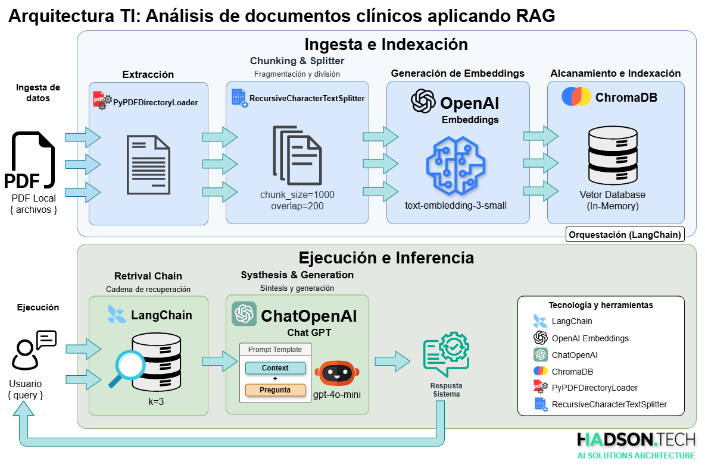

# Documentación Técnica: Pipeline RAG para Análisis de documentos clínicos

La documentación contempla la introducción, pasos para procesar archivos con RAG, Pipeline RAG para el Análisis de documentos clínicos, arquitectura y tecnologías, flujos, desglose de código fuente, resumen del código según el Pipeline RAG, casos de uso y escenarios validados para el sistema de **Generación Aumentada por Recuperación (RAG)** integrado por los módulos `rag_pipeline.py` y `app.py`; asimismo, detallamos algunas herramientas como analizadores para RAG con la finalidad de convertir el PDF a formatos limpios como Markdown. El sistema está optimizado para procesar expedientes médicos locales y responder consultas complejas minimizando alucinaciones.

## Introducción
Para leer archivos PDF en un sistema RAG (Generación Aumentada por Recuperación), debes extraer el texto, dividirlo en partes pequeñas, convertirlas a números (vectores) y guardarlas en una base de datos para que la IA responda preguntas. 

Para el desarrollo se considera el **Pipeline RAG para Análisis de documentos clínicos** utlizando Python bajo una *arquitectura estándar* de la industria, es decir, implementaremos el aplicando *LangChain*, *PyPDF* para la extracción, *ChromaDB* como base de datos *vectorial local (en memoria)* y *OpenAI* tanto para los embeddings como para el modelo de lenguaje (LLM).

### Pasos para procesar archivos con RAG
En este desarrollo aplicaremos el flujo estándar para procesar cualquier archivo PDF bajo un sistema de [Generación Aumentada por Recuperación (RAG)](https://github.com/devhadson/AI-Agent-Architecture/blob/main/006.RAG-Generacion-Aumentada-por-Recuperacion.md), es decir, para esta PoC aplicaremos cuatro principales fases:

   1. Extracción: Analizar el PDF y extraer todo el texto, tablas e imágenes.
   2. Fragmentación (Chunking): Dividir el texto largo en pedazos más pequeños (por ejemplo, párrafos o bloques de 500 palabras).
   3. Incrustación (Embedding): Convertir cada fragmento de texto en números (vectores) mediante modelos de IA.
   4. Almacenamiento y Búsqueda: Guardar estos vectores en una base de datos para que la IA busque los datos relevantes cuando el usuario haga una pregunta.


  > [!IMPORTANT]  
  > El Pipeline RAG desarrollado fue validado con archivos en formato PDFs almacenados un directorio local, sin embargo, el código no se limitar al formato del archivos.

Sin embargo, también existen herramientas sin código, es decir, servicios web con IA y soluciones avanzadas para desarrolladores que agilizan el procesamiento de los PDF's.

#### Herramientas Web Listas para Usar
Si no quieres programar, puedes subir tus archivos a plataformas que leen y resumen PDFs automáticamente utilizando IA:

* NotebookLM: Herramienta gratuita de Google que permite subir varios documentos y crear resúmenes o chatear con ellos.
* HiPDF: Plataforma en línea que permite subir un documento PDF y hacer preguntas sobre su contenido.
* Adobe Acrobat AI: Opción integrada en el lector oficial de Adobe para interactuar con tus documentos.

## Pipeline RAG para el Análisis de documentos clínicos

A continuación, presento el diseño del flujo que se aplicará para el desarrollo del sistema inteligente de Análisis de documentos clínicos.

```mermaid
graph LR
    %% Configuración de Estilos Generales
    classDef default fill:#f9f9f9,stroke:#333,stroke-width:1px;
    classDef destacado fill:#e1f5fe,stroke:#0288d1,stroke-width:2px;
    classDef baseDatos fill:#efebe9,stroke:#5d4037,stroke-width:2px;

    %% Nodos del Flujo
    A[📂 Directorio Local <br> 📑 Archivos PDF] -->|1. Carga masiva| B(📥 Extracción <br> ⚙️ PyPDFDirectoryLoader)
    B -->|2. Texto plano extraído| C(✂️ Fragmentación <br> 🧠 Chunking: 1000, Overlap: 200)
    C -->|3. Bloques de texto| D(🧬 Incrustación <br> 🏷️ text-embedding-3-small)
    D -->|4. Vectores numéricos| E(💾 Almacenamiento <br> ⚡ ChromaDB In-Memory)
    E -->|5. Indexación espacial| F[🔍 Búsqueda <br> 🎯 Recuperador K=3]

    %% Asignación de Estilos Especiales
    class B,C,D,E destacado;
    class A,F baseDatos;

    %% Personalización de enlaces (Aristas)
    linkStyle default stroke:#555,stroke-width:2px,circle;

```



### Desglose de los Componentes

1. **Extracción:**
    * **Entrada:** Directorio físico local que almacena los documentos.
    * **Proceso:** Lee de manera automatizada el texto binario de las páginas de los archivos PDF y lo unifica en texto plano estructurado.

2. **Fragmentación / Chunking:**
    * **Proceso:** Divide de forma inteligente el texto extenso en bloques homogéneos de un tamaño máximo predefinido.
    * **Métrica:** Se configuran ventanas semánticas con margen de solapamiento para evitar la pérdida de contexto entre fragmentos adyacentes.

3. **Incrustación:**
    * **Proceso:** Convierte las palabras y enunciados textuales procesados en la fase anterior en vectores de alta dimensionalidad (coordenadas matemáticas).

4. **Almacenamiento:**
    * **Proceso:** Colecciona y guarda de forma estructurada los vectores generados junto con sus metadatos fuente dentro de una base de datos indexada en memoria RAM para optimizar la velocidad.

- **Búsqueda e Inferencia:**

    * **Proceso:** Ejecuta algoritmos de similitud coseno sobre la base de datos para recuperar de forma exacta los `k` fragmentos más relevantes frente a una consulta del usuario, dejándolos listos para alimentar al LLM.    

---

## Arquitectura y Tecnologías Aplicadas

El sistema se basa en un patrón RAG desacoplado en dos capas lógicas claras (Ingesta y Ejecución) utilizando las siguientes tecnologías:



* **Orquestación General:** `LangChain` (versión 1.0+ compatible), usando abstracciones modernas para la separación de responsabilidades.
* **Extracción de Documentos:** `PyPDFDirectoryLoader` (`langchain_community`), encargado del parseo masivo de múltiples archivos PDF nativos dentro de directorios del sistema operativo.
* **Segmentación Semántica:** `RecursiveCharacterTextSplitter` (`langchain_text_splitters`), configurado con una estrategia de división jerárquica con solapamiento (*overlap*) para no romper oraciones o tablas críticas a la mitad.
* **Modelado de Embeddings:** `OpenAIEmbeddings` (`langchain_openai`), utilizando el motor de última generación de alta eficiencia dimensional `text-embedding-3-small`.
* **Base de Datos Vectorial:** `Chroma` (`langchain_chroma`), configurado como un motor indexador de producción residente en memoria intermedia (*In-Memory*) para respuestas ultrarrápidas y sin necesidad de persistencia compleja en disco.
* **Modelo de Lenguaje (LLM):** `ChatOpenAI` (`langchain_openai`) operando con `gpt-4o-mini`, seleccionado por su balance coste-rendimiento y velocidad de inferencia bajo contextos densos.
* **Gestión del Entorno:** `python-dotenv` para la inyección de llaves de API secretas en la arquitectura.

---

## Flujos del Sistema RAG

A continuación, se esquematizan de forma gráfica los procesos lógicos internos del software o sistema de Análisis de documentos clínicos:

### Flujo A: Fase de Ingesta, Extracción e Indexación Vectorial (`rag_pipeline.py`)

Este flujo se ejecuta una única vez al iniciar el software. Se encarga de transformar los archivos crudos (PDF) en estructuras matemáticas de datos legibles por el LLM.

```mermaid
graph LR
    A[📂 Directorio Local <br> './documentos_locales'] -->|1. Validación de existencia| B(PyPDFDirectoryLoader)
    B -->|2. Extracción de Texto Plano| C(RecursiveCharacterTextSplitter)
    C -->|3. Segmentación en Bloques <br> Chunk: 1000, Overlap: 200| D(OpenAI Embeddings <br> text-embedding-3-small)
    D -->|4. Conversión a Vectores| E(ChromaDB <br> Instancia en Memoria)
    E -->|5. Retorno Exitoso de Instancia| F[Vector Store Disponible para app.py]

    style A fill:#f9f,stroke:#333,stroke-width:2px
    style E fill:#bbf,stroke:#333,stroke-width:2px
    style F fill:#bfb,stroke:#333,stroke-width:2px

```



### Flujo B: Fase de Consulta y Generación Aumentada (`app.py`)

Este ciclo interactivo (REPL) procesa la entrada en lenguaje natural introducida por el usuario a través de la interfaz de la consola.


---

## Documentación Detallada del Código Fuente

### Módulo 1: `rag_pipeline.py` (ETL de Datos Vectoriales)

Este script actúa como el motor de carga del sistema. Sus puntos clave son:

1. **Validación y Resiliencia:** Utiliza la librería nativa `pathlib` para verificar si la carpeta `./documentos_locales` existe y si contiene archivos `.pdf`. Si está vacía, interrumpe la ejecución de forma segura retornando `None`, evitando errores de ejecución en el LLM.
2. **Mecanismo de Fragmentación:** * `chunk_size=1000`: Cada fragmento de texto tendrá un límite aproximado de 1000 caracteres.
* `chunk_overlap=200`: Permite que el final de un bloque comparta 200 caracteres con el inicio del siguiente bloque, lo que preserva la continuidad del significado en oraciones compuestas.


3. **Indexación:** `Chroma.from_documents` realiza la llamada paralela hacia la API de OpenAI para transformar los bloques en vectores numéricos de características e inicializa la base de datos local en memoria RAM.

### Módulo 2: `app.py` (Capa de Aplicación y Prompt Engineering)

Este componente maneja la interacción con el usuario y aplica directivas estrictas de seguridad cognitiva:

1. **Configuración del Recuperador (*Retriever*):** El vector store se expone con `as_retriever(search_kwargs={"k": 3})`. Esto indica que ante cualquier pregunta, el sistema buscará únicamente los 3 fragmentos matemáticamente más parecidos dentro de los PDF para usarlos como evidencia.
2. **Prompt Engineering Restrictivo:**

```text
"Eres un asistente virtual experto encargado de responder preguntas basándote únicamente en el contexto proporcionado. Si no sabes la respuesta o no está en los documentos, di explícitamente que no posees esa información."

```
Establecer la temperatura del LLM en `0` junto con esta instrucción reduce a cero la creatividad del modelo, forzándolo a actuar como un extractor de datos exacto.

3. **Uso de Cadenas Clásicas Actualizadas:** Adopta `create_stuff_documents_chain` y `create_retrieval_chain` para gestionar de extremo a extremo la inyección del contexto y la entrega de la llave `"respuesta"` en el diccionario de salida.

  > [!NOTE]  
  > Para la ejecución del Software desde VS Code, temporalmente elimino la variable `SSL_CERT_FILE` con el fin de consumir la API de OpenAI mediante HTTPS en mi entorno local.

---

## Resumen del Código según el Pipeline RAG
Este script procesa automáticamente todos los archivos PDF dentro de una carpeta local, ejecuta las 4 fases del pipeline y abre una interfaz de consola para interactuar con los documentos PDFs.

### Pipeline RAG según la Arquitectura del Software

Explicación del Pipeline RAG según la Arquitectura tecnológica del Software de Análisis de documentos clínicos

   1. *Extracción:* `PyPDFDirectoryLoader` escanea de manera eficiente el directorio local indicado. Transforma cada página de cada PDF en un objeto `Document` de LangChain que preserva el texto original junto con metadatos útiles (como el nombre del archivo y el número de página).
   2. *Fragmentación (Chunking):* Se utiliza `RecursiveCharacterTextSplitter`. La fragmentación inteligente busca cortes naturales respetando saltos de línea `\n\n`, `\n` y espacios. Se define un tamaño de fragmento de 1000 caracteres con un solapamiento de 200 para garantizar que la información que quede en los límites de un fragmento conserve su contexto en el siguiente.
   3. *Incrustación:* Utilizamos el modelo oficial `text-embedding-3-small` de OpenAI mediante la clase `OpenAIEmbeddings`. Este transforma cada fragmento de texto plano en un vector denso de números que representan su significado semántico.
   4. *Almacenamiento y Búsqueda:* Los vectores se indexan dentro de un motor de persistencia local rápido llamado `ChromaDB`. Cuando realizas una consulta, este motor calcula la distancia matemática (similitud de coseno) entre el vector de tu pregunta y los fragmentos indexados, devolviendo inmediatamente el contenido más relevante (`k=3`).

---

## Casos de Uso y Escenarios Validados

El pipeline está configurado y validado estructuralmente para resolver los siguientes escenarios del entorno de salud humana (basados en los documentos de la **Historia Clínica N° 81743**):

1. **Consulta de Datos Analíticos Cuantitativos:**
* *Pregunta:* *"¿Cuáles son los Últimos exámenes de control metabólico registrados de la H.C. 81743?"*
* *Comportamiento Validado:* El sistema extrae los bloques numéricos del PDF correspondientes a laboratorios (como Hemoglobina Glicosilada - HbA1c, Glucosa basal o perfiles lipídicos), filtrando de forma exacta la información sin alterar cifras ni fechas.


2. **Aislamiento de Observaciones Cualitativas Clínicas:**
* *Pregunta:* *"¿Cuál es la observación más relativa del informe endocrino en la H.C. 81743?"*
* *Comportamiento Validado:* El extractor recupera el fragmento donde el médico especialista anotó sus conclusiones o variaciones de diagnóstico, ignorando la información administrativa del reporte.


3. **Recuperación de Planes e Instrucciones de Tratamiento:**
* *Pregunta:* *"¿Cuál es el último PLAN DE ALIMENTACIÓN INDIVIDUALIZADO PARA CONTROL DE DIABETES de la H.C. 81743?"*
* *Comportamiento Validado:* El recuperador aisla la sección de la dieta personalizada guardada en el historial clínico de este paciente en particular, asegurando que el LLM devuelva las instrucciones dietéticas indicadas.

> [!IMPORTANT]  
> Se pude agregar más casos por ejemplo basado en el documento de la **Historia Clínica N° 63290** u otros.

---

## Los Mejores Analizadores (Parsers) para RAG
Para que tu propio sistema RAG entienda el contenido correctamente, es clave convertir el PDF a formatos limpios como Markdown. En la actualidad existe las siguientes herramientas más recomendadas son:

* Firecrawl: Extrae y procesa automáticamente PDFs escaneados y de texto generando un Markdown estructurado.
* Docling: Herramienta local y de código abierto que produce Markdown de alta calidad ideal para flujos de trabajo de IA.
* Marker-PDF: Analizador de código abierto muy rápido y efectivo para extraer texto y tablas.
* Document AI (Google Cloud): Solución avanzada ideal para analizar estructuras complejas como documentos financieros.

Si deseas llevar este código a producción, te sugiero añadir un *historial de conversación* para habilitar el contexto de memoria multi-turno. ¿Te gustaría que adaptemos el código para agregarle memoria o prefieres modificar el almacenamiento para que persista en el disco duro en lugar de ejecutarse en memoria?

---

*Documentación y app elaborado por [Hadson Paredes](https://www.linkedin.com/in/hadson-paredes/) - 2026*
- Repositorio [RAG-App-FilesPDF-Processing](https://github.com/devhadson/RAG-Langchain-App-FilesPDF-Processing)
- Disponible como recurso públicos en [Hadson.Tech](https://hadson.tech/public-resources/project-rag-ai/rag-langchain-app-filespdf-processing)

<hr>
<div align="center">
Publicaciones en mis redes sociales y repositorio GitHub<br>
<strong>Sígueme en mis redes sociales</strong><br><br>
  <a href="https://github.com/devhadson">
    
  </a>
  <a href="https://www.linkedin.com/in/hadson-paredes/">
    
  </a>
  <a href="https://www.facebook.com/hadson.paredescordova/">
    
  </a>
  <a href="https://x.com/hadson_paredes">
    
  </a>
</div>